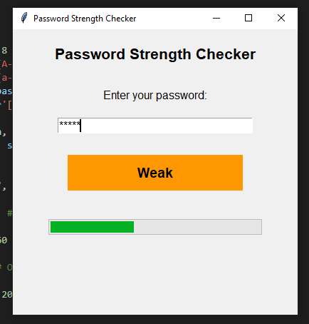

# Password Strength Checker

A simple Python application built using **Tkinter** to evaluate and display the strength of a password in real-time. The application visually indicates the strength of the password with both text and a progress bar.

## Features

- **Real-time evaluation**: Checks password strength as you type.
- **Visual feedback**: Displays strength as text (e.g., "Very Weak", "Moderate", "Strong") and a color-coded progress bar.
- **Criteria-based analysis**: Considers length, uppercase, lowercase, numeric, and special characters.
- **User-friendly interface**: Built with Tkinter for a clean and simple UI.

## Demo

  
*Screenshot showing the password strength checker in action.*

## Requirements

- Python 3.x
- Tkinter (comes pre-installed with Python)
- `re` module (included in the Python standard library)

## Installation

1. Clone the repository:
    ```bash
    git clone https://github.com/Unknonhack/password-strength-checker.git
    cd password-strength-checker
    ```

2. Run the script:
    ```bash
    python password_strength_checker.py
    ```

## Usage

1. Open the application.
2. Enter your password in the text field.
3. Observe the password strength displayed in real-time through text feedback and the color-coded progress bar.

## Password Strength Criteria

- **Very Weak**: Fewer than 2 criteria met.
- **Weak**: 2 criteria met.
- **Moderate**: 3 criteria met.
- **Strong**: 4 criteria met.
- **Very Strong**: All 5 criteria met.

## Contributing

Contributions are welcome! Feel free to submit issues or pull requests to improve the functionality or UI.

## License

This project is licensed under the MIT License. See the `LICENSE` file for details.

## Acknowledgments

Thanks to the Python and Tkinter communities for their extensive documentation and resources.
